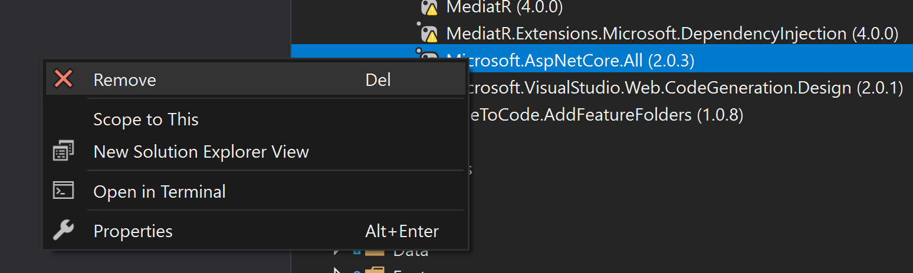
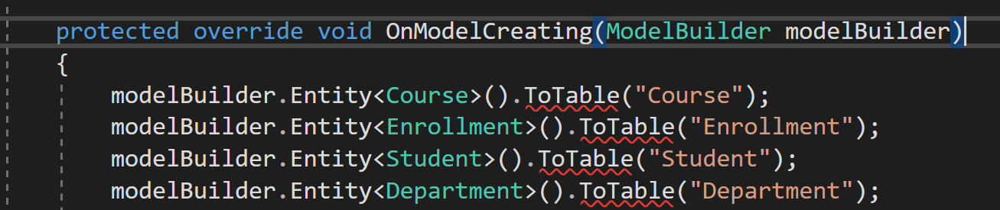

# steps
* change target framework in every project 
```
<Project Sdk="Microsoft.NET.Sdk.Web">

  <PropertyGroup>
-    <TargetFramework>netcoreapp3.1</TargetFramework>
+    <TargetFramework>net5.0</TargetFramework>
  </PropertyGroup>

</Project>
```
* delete all bin and obj folders
* clear all .nuget packages
```
dotnet nuget locals --clear all
```
* upgrade all nuget packages for the solution

# problem I ran into
* errors package
```
Severity	Code	Description	Project	File	Line	Suppression State
Error	NETSDK1079	The Microsoft.AspNetCore.All package is not supported when targeting .NET Core 3.0 or higher.  A FrameworkReference to Microsoft.AspNetCore.App should be used instead, and will be implicitly included by Microsoft.NET.Sdk.Web.	ContosoUniversity	C:\Program Files\dotnet\sdk\6.0.100-preview.1.21103.13\Sdks\Microsoft.NET.Sdk\targets\Microsoft.NET.Sdk.DefaultItems.targets	130	
```
Solution: https://docs.microsoft.com/en-us/dotnet/core/tools/sdk-errors/netsdk1079


- move from Microsoft.AspNetCore.All to Microsoft.AspNetCore.App

* errors mediatr


Solution: https://github.com/jbogard/MediatR/wiki/Migration-Guide-4.x-to-5.0

* errors entity framework core



# commands
dotnet nuget locals --clear all

# readings
[Migration website](https://docs.microsoft.com/en-us/aspnet/core/migration/31-to-50?view=aspnetcore-5.0&tabs=visual-studio)